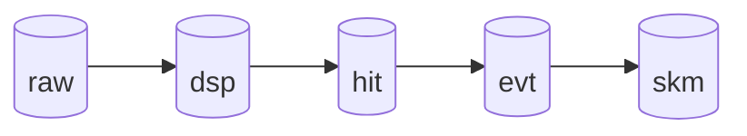

# Juleana.jl - Processor Documentation

This documentation describes the data processing pipeline for LEGEND-200 data.

## Overview



## Documentation Structure

Each processor has its own folder with:

```
docs/
├── index.md
└── <processor_name>/
    ├── processor_flow.md           # Processor overview
    └── analysis_functions/         # Detailed function docs
        ├── function1.md
        └── function2.md
```

### Hierarchy:
1. **Processor Flow** - What the processor does (Input → Workflow → Output)
2. **Analysis Functions** - Detailed function documentation
   - Function signature and parameters
   - Processing pipeline stages (collapsible)
   - Sub-functions with algorithms (nested collapsible)

---

## Processors

### DSP Tier

| Processor | Category | Documentation |
|-----------|----------|---------------|
| process_dsp_phy | phy | [📁 process_dsp_phy/](process_dsp_phy/) |

  **Files:**
  - [processor_flow.md](process_dsp_phy/processor_flow.md) - Processor overview
  - [dsp_icpc_compressed.md](process_dsp_phy/analysis_functions/dsp_icpc_compressed.md) - HPGe DSP function

### Other Tiers (TODO)
| Processor | Category | Flow | Functions |
|-----------|----------|------|-----------|
| process_energy_calibration | cal | [Flow](processor_flow/process_energy_calibration.md) | [Functions](analysis_functions/process_energy_calibration.md) |
| process_decay_time | cal | [Flow](processor_flow/process_decay_time.md) | [Functions](analysis_functions/process_decay_time.md) |
| process_filter_optimization | cal | [Flow](processor_flow/process_filter_optimization.md) | [Functions](analysis_functions/process_filter_optimization.md) |
| process_aoe_optimization | cal | [Flow](processor_flow/process_aoe_optimization.md) | [Functions](analysis_functions/process_aoe_optimization.md) |
